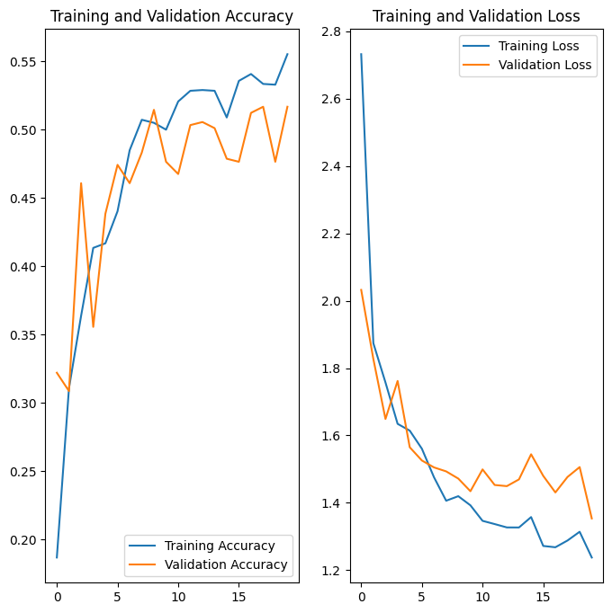

# Project : Melanoma Detection Assignment
>This is assignment on Melanoma Skin Cancer to build a multiclass classification model using a custom convolutional neural network in tensorflow which can accurately detect melanoma.

## Table of Contents
* [General Info](#general-information)
* [Technologies Used](#technologies-used)
* [Conclusions](#conclusions)
* [Acknowledgements](#acknowledgements)

<!-- You can include any other section that is pertinent to your problem -->

## General Information
Melanoma is a type of skin cancer that develops from melanocytes, the cells responsible for producing melanin, the pigment that gives skin its color. Though it is less common than other skin cancers, melanoma is more dangerous because it is more likely to spread to other parts of the body if not detected and treated early.

### Background
The primary cause of melanoma is exposure to ultraviolet (UV) radiation from the sun or tanning beds. UV radiation can damage the DNA in skin cells, leading to mutations that cause cancer.
Early detection of melanoma is crucial. Symptoms include:

- New Moles: The appearance of new moles or spots on the skin.
- Changes in Existing Moles: Changes in size, shape, color, or texture of existing moles.
- ABCDE Rule: A helpful guide for recognizing potential melanomas:
  -  Asymmetry: One half of the mole does not match the other half.
  -  Border: Edges are irregular, ragged, or blurred.
  -  Color: Color is not uniform and may include shades of brown, black, pink, red, white, or blue.
  -  Diameter: Diameter is larger than 6mm (about the size of a pencil eraser).
  -  Evolving: Changes in size, shape, color, or symptoms such as itching or bleeding.

### Problem Statment
To build a multiclass classification model using a custom convolutional neural network in tensorflow which can accurately detect melanoma. It accounts for 75% of skin cancer deaths. A solution that can evaluate images and alert dermatologists about the presence of melanoma has the potential to reduce a lot of manual effort needed in diagnosis.

### Dataset
The dataset consists of 2357 images of malignant and benign oncological diseases, which were formed from the International Skin Imaging Collaboration (ISIC). All images were sorted according to the classification taken with ISIC, and all subsets were divided into the same number of images, with the exception of melanomas and moles, whose images are slightly dominant.

<!-- You don't have to answer all the questions - just the ones relevant to your project. -->

## Conclusions
- First model that is created has less accuracy and also there is difference between the training and validation accuracy which shows the sign of model overfitting. 

- Second model that is created after performing data augmentation has also less accuracy but the problem of overfitting is resolved.

- Third model is overfiting which can be solved by adding more layers, neurons or dropout layers. The training accuracy of the model is still not very good but it can be increased with the help of hyperparameter tuning.

<!-- You don't have to answer all the questions - just the ones relevant to your project. -->

## Technologies Used
- Pandas - version  2.1.4
- NumPy - version 1.26.2
- Seaborn - version 0.12.2
- MatplotLib - version 3.7.2
- Tenserflow - 2.15.0

<!-- As the libraries versions keep on changing, it is recommended to mention the version of library used in this project -->

## Acknowledgements
This project was provided by UpGrad under IIITB Programme as a assignment for the convolutional neural network in tensorflow.

## Contact
Created by [@anishkumardubey] - feel free to contact me!

## License
This project is open source and available for everyone in public repository.